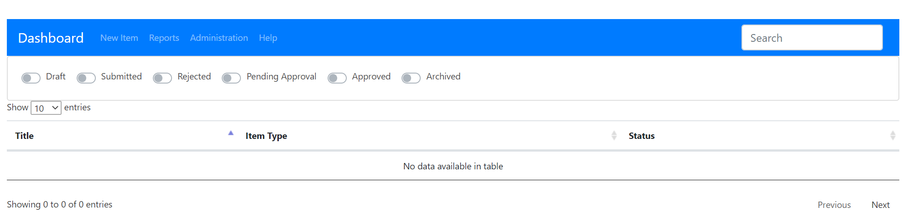
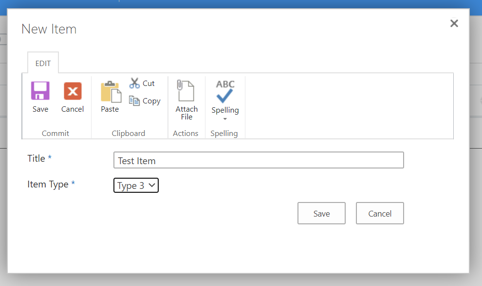
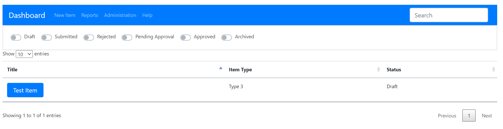

# SharePoint Dashboard

This demo will give a step-by-step tutorial of creating a basic dashboard solution.

## Required Tools

- [NodeJS](https://nodejs.org/en/)
- [Visual Studio Code](https://code.visualstudio.com/) or equivalent

## Overview

- [[Clone Project|Step 1]]
- [[Configure Project|Step 2]]
- [[SharePoint Assets|Step 3]]
- [[Main File|Step 4]]
- [[Dashboard|Step 5]]
  - [[Navigation|Step 6]]
  - [[Filter|Step 7]]
  - [[Table|Step 8]]
- [[Demo|Step 9]]