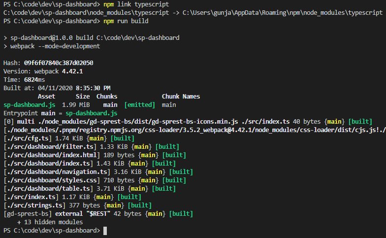
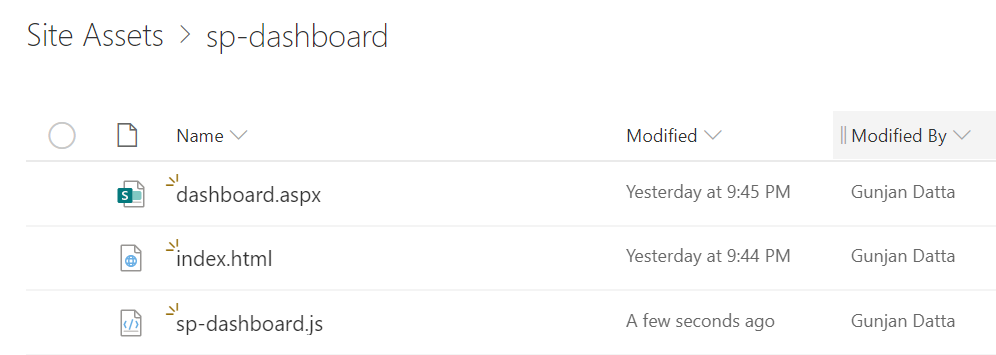
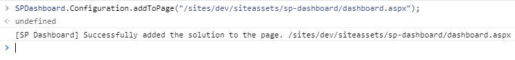
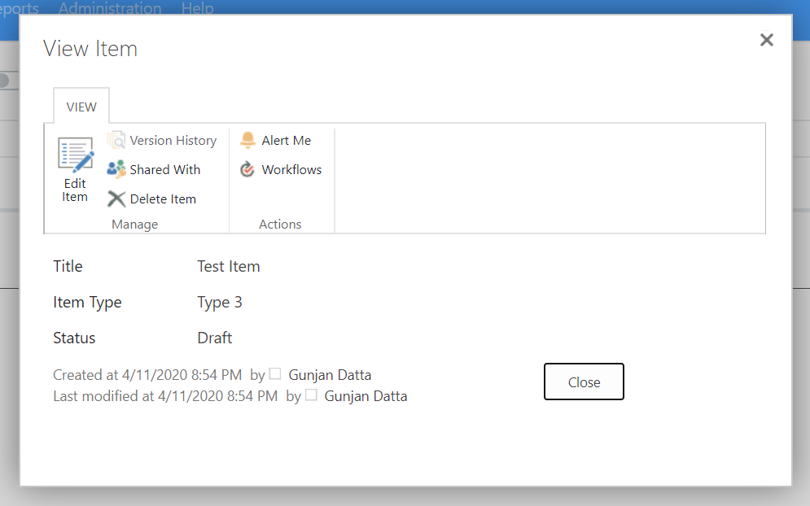

### [[Previous Step|Step 8]]

# Demo

### Build Solution

- Link TypeScript
  - `npm link typescript` _Only needs to be done once_
- Build Solution
  - `npm run build`



### Upload Assets

#### 1) Create a webpart page called `dashboard` and move it to the assets folder

#### 2) Upload the following files to the `SolutionUrl` property in the `src/strings.ts` file

- assets/index.html
- dist/sp-dashboard.js



### Install Solution

#### 1) Go to the `dashboard.aspx` and access the browser console window (F-12 or Ctrl+Shift+I)

#### 2) Reference the solution

```js
var s=document.createElement("script");
s.src="/sites/dev/siteassets/sp-dashboard/sp-dashboard.js";
document.head.appendChild(s);
```

#### 3) Create the SharePoint Assets

```SPDashboard.Configuration.install();```


#### 4) Add Solution to Page

The global variable name was defined in the ```src/strings.ts``` file.

```SPDashboard.Configuration.addToPage("/sites/dev/siteassets/sp-dashboard/dashboard.aspx");```



### View Dashboard

Refresh the page and view the dashboard.


### Create Item

Click on the `New Item` navigation link and create a new item.


### View Item

The page will refresh automatically and you will see the new item in the dashboard.


Click on the item button to view the display form.



### Uninstall Solution

#### 1) Go to the `dashboard.aspx` and access the browser console window (F-12 or Ctrl+Shift+I)

#### 2) Remove SharePoint Assets

```SPDashboard.Configuration.uninstall();```